# Python-LearnOpenGL

Python3 port of https://github.com/JoeyDeVries/LearnOpenGL
The repo covered all 6 chapters, and I also migrated all codes to use OpenGL 4.6.

All codes tested on Windwos 10 and Python 3.10.6.

If you enjoy the repository, please give my repo a star ⭐ ⬆️. 

## Requirements
Python needs >= 3.9
* glfw
* PyOpenGL
* numpy
* PyGLM
* imageio (include Pillow)
* pyassimp

## Screenshot
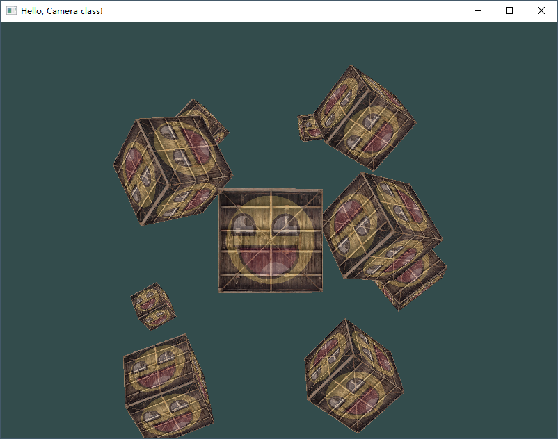
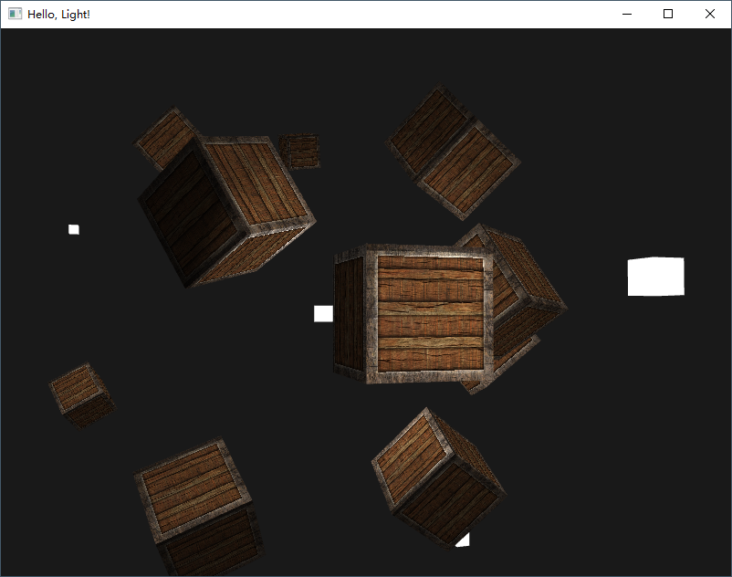
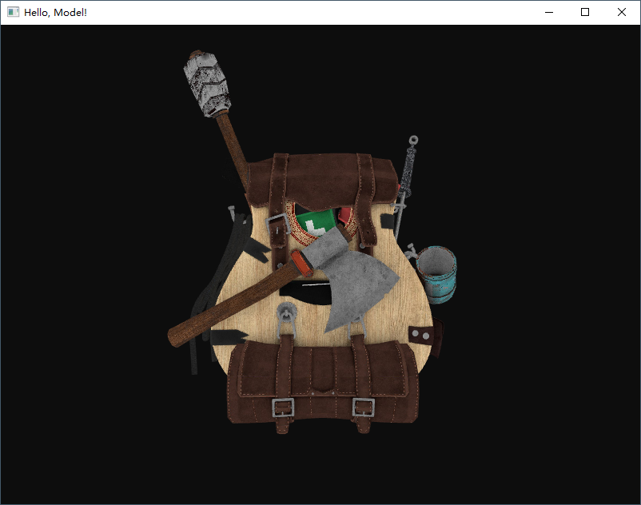
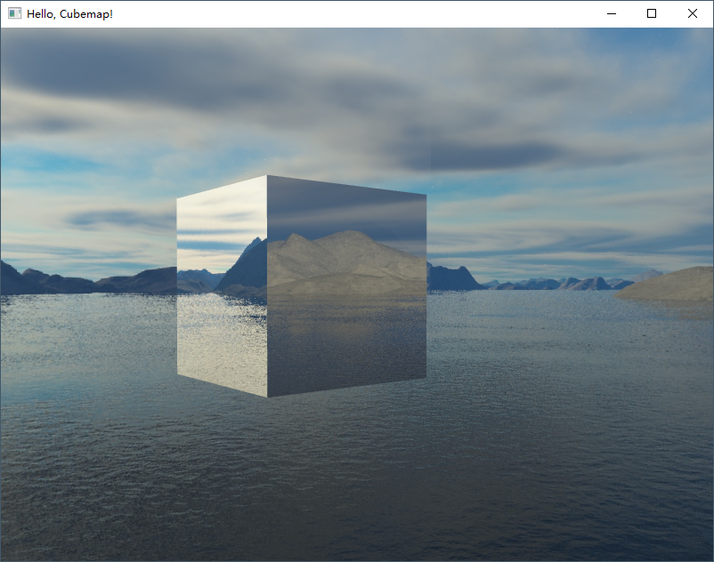
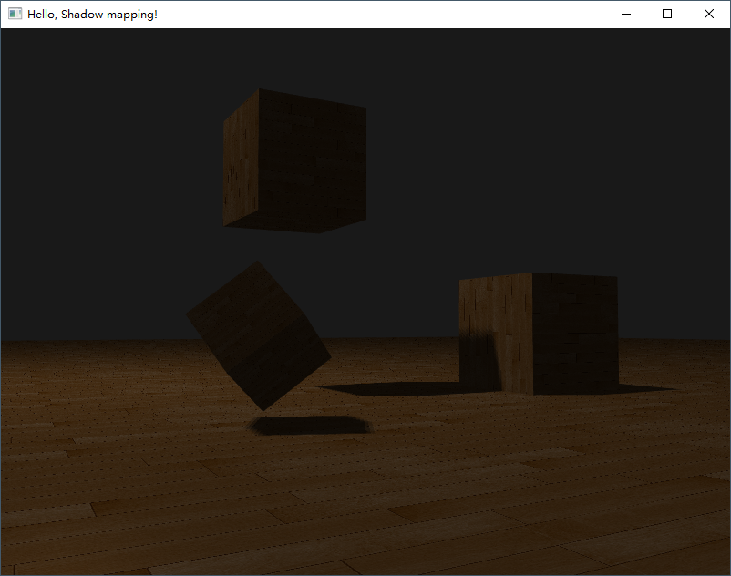
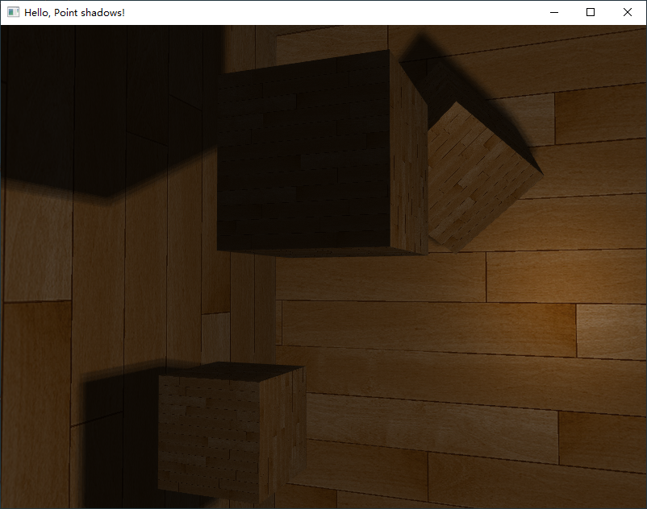
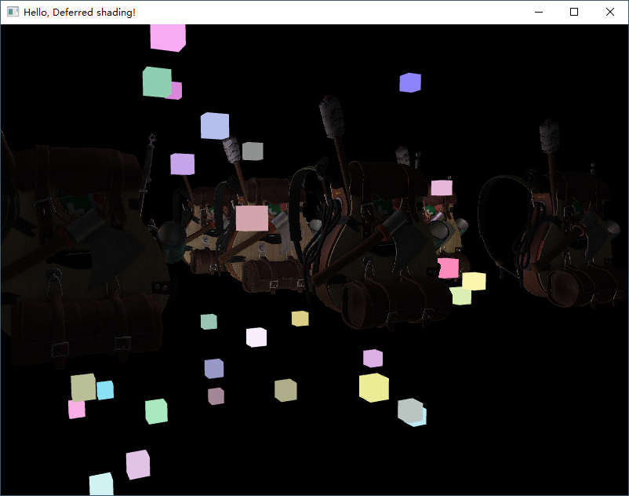
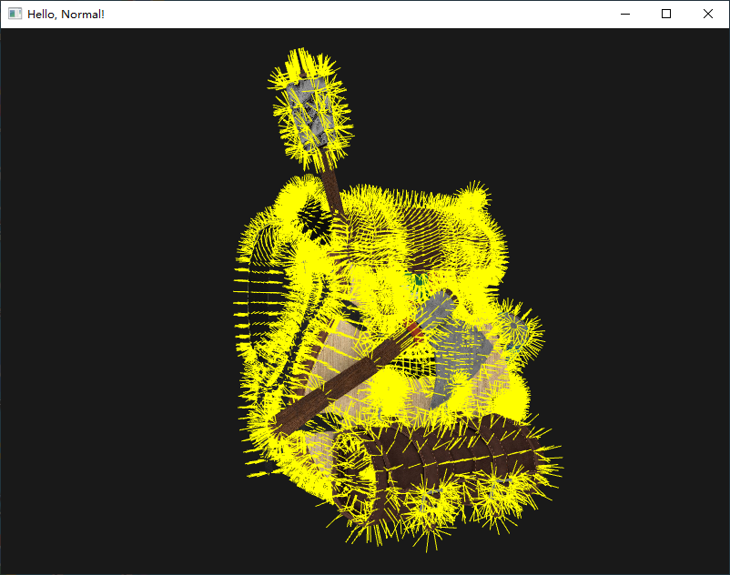
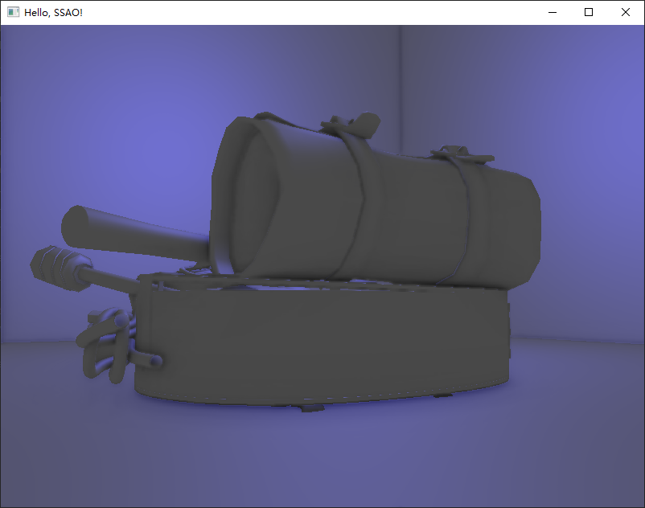
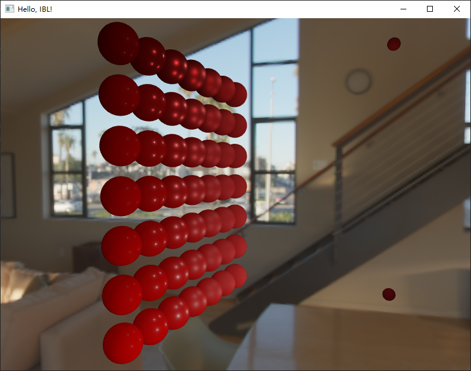
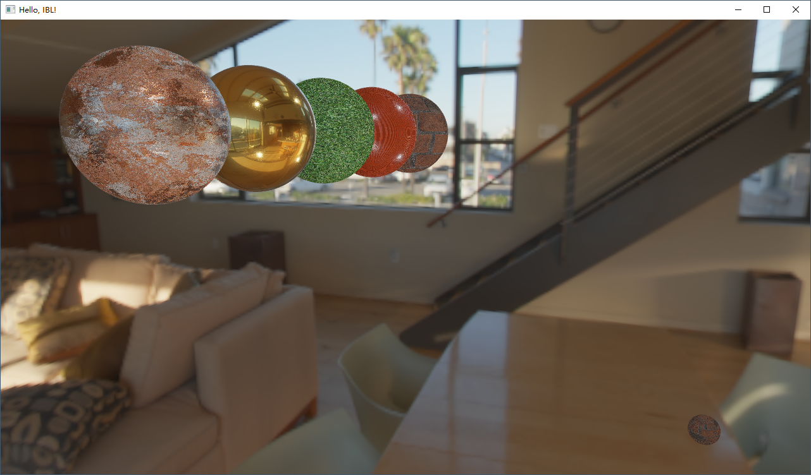

